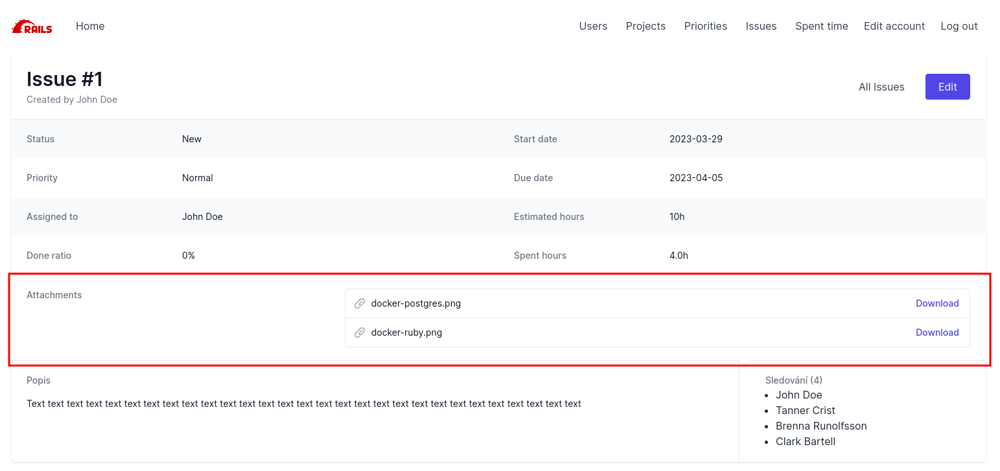

# Ruby on Rails 7

Prezentace: https://bit.ly/OSU-RoR \
VirtualBox image: https://drive.google.com/file/d/1KJsMIWKaeDn5jaGxnp54roZE8_TC25Fe/view

## Spuštění env a serveru

Stažení repozitáře

```
$ git clone https://gitlab.railsformers.com/osu/osu-rails-7.git
$ cd osu-rails-7
```

Spuštění serveru a interaktivní konzole, testů naleznete [zde](ENVIRONMENT.md)

## 1. Rails bootstrap

https://guides.rubyonrails.org/getting_started.html \
https://api.rubyonrails.org/ \
[TailwindUI komponenty Ctrl-C Ctrl-V](https://tailwindui.com/components)

### Vygenerování aplikace

```
rails new . --skip-git --skip-test --skip-bootsnap --css tailwind
```

```
rails g rspec:install
```

```
rails g simple_form:tailwind:install
```

## 2. Úkoly

### 2.1 ERD


### 2.2  Vygenerujte MVC pomocí příkazů

Příkazy z úkolu 4:
```
rails generate scaffold User first_name:string last_name:string email:string
```

```
rails generate scaffold project name:string description:text user:references
```

```
rails generate scaffold priority name:string
```

```
rails generate scaffold issue subject:string description:text start_date:date due_date:date status:integer estimated_hours:integer done_ratio:integer priority:references user:references project:references assigned_to_id:integer:index
```

```
rails generate model time_entries spent_on:date hours:float comments:string project:references user:references issue:references
```

Příkazy z úkolu 5:
```
rails generate model journal issue:references user:references notes:text
```

```
rails generate model journal_details journal:references property:string old_value:string value:string
```

```
rails generate model watchers issue:references user:references
```

Vygeneruje controller dashboard s akcí index:
```
rails g controller dashboard index
```

Příkazy z úkolu 6:
```
rails g controller time_entries index
```

**Příkazy pro toto cvičení:**
```
rails generate mailer Issue send_journal
```

Všechny příkazy můžete vygenerovat pomocí skriptu: \
`env_script` nahraďte vaším [prostředím](ENVIRONMENT.md)
```
env_script ./scaffold.sh
```

Překopírujte si veškeré hotové úkoly ze cvičení 4->5->6->7
```
cd osu-rails-7

# win
xcopy ..\osu-rails-6\app\* app\ /s /e

# linux
cp -r ../osu-rails-6/app/* app/
```
upravte `routes.rb`

### 2.3 Autentizace (2b)

  * pokračujte dle [dokumentace](https://github.com/heartcombo/devise#getting-started)
    1. přidáte do `Gemfile` - `gem 'devise'` - máte již přidáno
    2. instalator devise - `$ rails generate devise:install` - views už máte připraveny v projektu - **nespouštějte** tedy příkaz `rails g devise:views`
    3. nastavení modelu user - `$ rails generate devise User`
    4. v migraci `..._add_devise_to_users.rb` změňte řádek:
      * `t.string :email,              null: false, default: ""`
      * na
      * `t.change :email, :string, null: false, default: ""`
      * jelikož tabulka `users` již obsahuje atribut `email`
    5. spusťte migrace: `rails db:migrate db:seed`
    6. do `ApplicationController` přidejte:
      ```
        class ApplicationController < ActionController::Base
          protect_from_forgery
          before_action :authenticate_user!
          before_action :configure_permitted_parameters, if: :devise_controller?

          protected

          def configure_permitted_parameters
            devise_parameter_sanitizer.permit(:sign_up, keys: [:first_name, :last_name])
          end
        end
      ```
    7. nyní když přijdete na jakoukoliv stránku, musíte se přihlásit
      * přihlášení můžete testovat na emailu `john@doe.com`
      * výchozí heslo pro všechny vygenerované uživatele je `password`

    8. změnu hesla můžete testovat např přes [MailHog](ENVIRONMENT.md#mailhog-httplocalhost8025) na adrese http://localhost:8025/

    9. pokud chcete `current_user` mít přístupný také v modelu:
      * vytvořte soubor `app/modles/current.rb`:
        ```
          class Current < ActiveSupport::CurrentAttributes
            attribute :user
          end
        ```
      * do `ApplicationController` přidejte:
        ```
          class ApplicationController < ActionController::Base
            # ...
            before_action :set_current_user
            # ...

            private

            def set_current_user
              Current.user = current_user
            end
          end
        ```
      * potom lze v modelu volat `Current.user`

### 2.4 ActionMailer (1b)

Vygenerovali jste mailer `IssueMailer`:
  * bude se posílat [z emailové adresy](https://guides.rubyonrails.org/action_mailer_basics.html#walkthrough-to-generating-a-mailer) "noreply@rails.cz"
  * [předmet](https://apidock.com/rails/ActionMailer/Base/mail) emailu bude vypadat: "[Project name - #IssueID] Issue name"
  * obsah emailu bude:
    ```
    Issue #issue.id: issue.subject
    Project: issue.project.name
    Author: issue.user
    Status: issue.status
    Priority: issue.priority
    Assigned to: issue.assigned_to
    Start date: issue.start_date
    Due date: issue.due_date
    ```
  * email se bude posílat vždy po úpravě modelu `Issue`, jako callback `after_update` uživatelům: user, assigned_to, a všem kteří úkol sledují (vazba watchers), každé osobě dojde pouze jeden email, tedy použijte [uniq](https://apidock.com/ruby/Array/uniq)
  * testování přes rspec `rspec rspec spec/models/issue_spec.rb spec/mailers/issue_mailer_spec.rb -t tasks7`
  * přijetí emailu otestujete přes [MailHog](ENVIRONMENT.md#mailhog-httplocalhost8025) na adrese http://localhost:8025/

### 2.5 ActiveStorage (1b)

  * pokračujte dle [dokumentace](https://edgeguides.rubyonrails.org/active_storage_overview.html#setup)
  * v případě že již používáte `ActionText` tak `ActionStorage` již máte nainstalován, příkaz `rails active_storage:install` tedy nic nového negeneruje
  * do modelu `Issue` přidejte, že model může mít [více souborových příloh](https://edgeguides.rubyonrails.org/active_storage_overview.html#has-many-attached) `attachments`
  * povolte `attachments: []` v `IssuesController` v permited params
  * do detailu issue vypište [názvy souborů](https://api.rubyonrails.org/classes/ActiveStorage/Blob.html#method-i-filename) s [odkazem ke stažení souboru](https://edgeguides.rubyonrails.org/active_storage_overview.html#redirect-mode)
    * 
